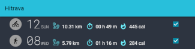

[](https://cthru.duckdns.org/hitrava-web)  

[![nposl3.0][shield nposl3.0]][tldrlegal nposl3.0]
[![GitHub release (latest by date)][shield release]][latest release]
[![GitHub Release Date][shield release date]][latest release]
[![PayPal][shield paypal]][paypal]
[![Buy me a coffee][shield buymeacoffee]][buymeacoffee]

----------
## Notice  
There is a temporary issue with the cthru.hopto.org website address due to a mistake on my part.
For now, the website can be reached at [https://cthru.duckdns.org](https://cthru.duckdns.org).

----------
## Introduction
Hitrava converts health activities registered using a Honor or Huawei activity tracker or smartwatch in the 
[`Huawei Health`](https://play.google.com/store/apps/details?id=com.huawei.health) app into a file format that can be 
directly uploaded to [`Strava`](https://strava.com).

----------
### Hitrava Web
[](https://cthru.duckdns.org/hitrava-web)  
  
**12-Jan-2025: [Hitrava Web](https://cthru.duckdns.org/hitrava-web) now also supports the new Huawei 2025 ZIP export format.**  
If you prefer on-line conversion in a web app with GUI over a script, 
you can give it a try on [https://cthru.duckdns.org](https://cthru.duckdns.org/hitrava-web).

----------

## Table of Contents
- [Introduction](#introduction)  
    - [Hitrava Web](#Hitrava-Web)
- [Features](#features)  
- [Installation](#installation)  
- [How To Convert](#how-to-convert-your-health-activities-and-import-them-in-strava)   
  -[Windows / Linux / macOS Users](#windows--linux--macos-users---encrypted-zip-conversion-procedure)  
  -[Other Operating Systems](#other-operating-systems-manual-unzip)  
- [Usage](#usage)  
    - [Command Line Arguments](#command-line-arguments-overview)  
    - [Examples](#usage-examples)
- [Uploading to Garmin Connect](#uploading-to-garmin-connect)
- [Release Notes](#release-notes)  
- [Copyright and License](#copyright-and-license)
- [Aim for the stars](#star-history)

## Features
- Recognizes and converts the following activity types from Huawei Health to Strava:
    - Running: both outdoor and indoor running (treadmill run)
    - Cycling: both outdoor and indoor cycling
    - Swimming: both pool swimming and open water swimming
    - Walking
    - Hiking
    - Cross-country run
    - Cross Trainer (Elliptical)
    - Crossfit
- Conversion contains generic activity information such as GPS track, distance, duration, calorie consumption (as
available during recording of the activity).
- When available and depending on the activity type, conversion includes health data from your Huawei or Honor smartwatch / fitness band:
    - Heart rate
    - Cadence
- Conversion is done using the centralized data from Huawei Health. In principle, any recent Huawei or Honor smartwatch
or fitness band should be supported, if you see the data in Huawei Health, e.g. 
    - Huawei smartwatches: e.g. Huawei Watch GT2 
    - Huawei fitness bands: e.g. Huawei Band 4, Huawei Band 4 Pro
    - Honor smartwatches: e.g. Honor MagicWatch 2
    - Honor fitness bands: e.g. Honor Band 4, Honor Band 5
    
## Installation
### Requirements
To use Hitrava, you need:
- [`Python 3.12.1`](https://www.python.org/downloads/) or higher.
    - Python 3.12.1 is the lowest recommended version (developed and tested on this version).
    - Older Python versions might still work, but were / are not actively being tested.
- A Huawei account to request your health data.
- 7-Zip stand-alone version to convert directly from an encrypted Huawei Health ZIP file. Currently, this method is only 
supported on Windows and Linux operating systems.

### Installation Procedure
#### Step 1 - Install Python
Only required if you don't have a (suitable) python installation on your system.
- Download the latest Python version for your operating system from the [`Python website`](https://www.python.org/downloads/).
- Run the Python installer (Windows) or follow the instructions for your operating system. 

#### Step 2 - Download and Extract Hitrava
- Go to the [Releases page][latest release] to download the source code of the latest Hitrava release.
- On the [Releases page][latest release], in the _Assets_ section, click on the _Source code (zip)_ link to download 
  the sources.
- Save the ZIP file with the sources on your system.
- Extract all contents of the ZIP file with the sources to a location of your choice on your system.

#### Step 3 - Download and Extract Stand-alone 7-Zip
NOTE: This step is required to convert **encrypted** Huawei Health ZIP files.

##### Windows Users
- Download the latest 7-zip **stand-alone** console version from the [`7-Zip website`](https://www.7-zip.org/download.html).
The stand-alone version can be identified by the description below:
  > 7-Zip Extra: standalone console version, 7z DLL, Plugin for Far Manager
- Extract the file _7za.exe_ from the downloaded archive and place it in your Hitrava installation folder from step 2 
above. Your Hitrava installation folder should now contain at least the following files.
  > Hitrava.py  
  > 7za.exe  
  > Run_Hitrava_Decrypt.cmd
  
##### macOS Users
macOS users can install the `p7zip` package through Homebrew 
- If [Homebrew](https://brew.sh/) is not on your system, install [Homebrew](https://brew.sh/) 
by following the instructions from the [Homebrew](https://brew.sh/) web page.
- If the `p7zip` package is not on your system, install it using the command below in a `Terminal` window.  
  ```
  brew install p7zip
  ```

## How to convert your health activities and import them in Strava
All users can use conversion from a **[ZIP](#Windows-Users---Encrypted-ZIP-conversion-procedure)** file or a **[JSON](#JSON-file-conversion-example)** file.  
For users with rooted phones, legacy **[file](#single-file-conversion-examples)** and 
**[tar](#tar-file-conversion-examples)** options are still available.

### Windows / Linux / macOS Users - Encrypted ZIP conversion procedure
NOTE: As of late October 2020, the latest version of the Huawei Health app obliges you to provide a password with which 
your data in the ZIP file will be encrypted. If you need to convert from an older non-encrypted ZIP file, please refer 
to the **[corresponding example](#zip-file-conversion-example)**.
 
Activities can be mass converted using the data in a ZIP file that you can request in the Huawei Health app.

The procedure below assumes that you [installed Hitrava](#installation) and are logged in with your Huawei account in
the Huawei Health app. If you don't have a Huawei account, you can create one in the app.  

#### Step 1 - Request your data in the Huawei Health app
**Before you read any further in this paragraph, 
there is a complete step-by-step guide with pictures on how to request your Huawei Health data.
Head over to the ['How To Convert' article on the cthru website](https://cthru.duckdns.org/hitrava-web/convert/)**.

- On your phone, open the Huawei Health app.
- Tap the **'Me'** button in the lower right-hand corner of the main screen.
- Now tap on your account name on top of the screen.
- Tap on **'Privacy Center'**. 
- Tap **'Request Your Data'**. 
- Select **'Health'** from the list and confirm your selection.
- You will be obligated to enter a password to encrypt the requested data with. You will need this password later in
step 3 below.   
- Follow any further in-app instructions.
- Wait for the mail from Huawei to arrive with a link to download the data (ZIP file). 

#### Step 2 - Download your requested data
- In the mail from Huawei, click on the link to download your data and follow the instructions.
- Put (a copy of) the downloaded ZIP file in the Hitrava installation folder and rename it to _HiZip.zip_. 

#### Step 3 - Convert the data with Hitrava

>**Tip**: If you're on Windows, and you're not familiar with the Command Prompt or just want to do a quick
> conversion with default arguments, you can use the _Run_Hitrava_Decrypt.cmd_ batch file.
>- Open the _Run_Hitrava_Decrypt.cmd_ file with a text editor and change the password 123456 to the password you 
>provided in step 2 above. 
>- double-click the _Run_Hitrava_Decrypt.cmd_ file in the installation folder of Hitrava.  
> This will convert all available activities in the ZIP file from the previous step.                                                                                                                   

- Open a Command Prompt and change the directory to the installation folder of Hitrava.
- In the Command Prompt, run Hitrava.py with the --zip command line argument. You can start from the default example 
command below or [add / change command line arguments](#command-line-arguments-overview) as you need.  

**IMPORTANT**: You must replace the password 123456 with the password you provided in step 2 above.
  ```
  Hitrava.py --zip HiZip.zip --password 123456 --json_export
  ```
  The above command will generate both the original HiTrack files and the converted TCX files for ALL activities to the
  _output_ subfolder of the Hitrava installation folder. In this folder:
  - Files without an extension are the Huawei HiTrack files which contain the raw unconverted data of an activity. 
  - Files with the _.json_ extension represent an exported copy of the JSON data of a single activity. 
  - Files with the **_.tcx_** extension are the **converted files** suitable for upload to Strava.

#### Step 4 - Upload your data to Strava
You can now go to the Strava website to import your data.
- Go to the **[`'Upload and Sync Your Activities'`](https://www.strava.com/upload/select)** page on Strava. 
- Log in with your Strava account. 
- Once logged in, use the **'Browse...'** button on the page and select the converted TCX files (with the _.tcx_ 
extension, up to 25 at once) to upload. 

### Other Operating Systems (Manual Unzip)
#### Step 1 - Request your data
Follow the same procedure as for Windows users explained [above](#step-1---request-your-data-in-the-huawei-health-app).

#### Step 2 - Download and extract your data
- In the mail from Huawei, click on the link to download your data and follow the instructions.
- Extract the following file(s) from the downloaded ZIP file using an unzip tool for your operating system that supports
 AES encrypted ZIP files.
  > Motion path detail data & description/motion path detail data{epoch datetimestamp goes here}.json
- Put (a copy of) an extracted file in the Hitrava installation folder and rename it to HiJson.json.

#### Step 3 - Convert the JSON file with Hitrava
- Open a Terminal window and change the directory to the installation folder of Hitrava.
- In the terminal Prompt, run Hitrava.py with the --json command line argument. You can start from the default example
  command below or [add / change command line arguments](#command-line-arguments-overview) as you need.
  ```
  python3 Hitrava.py --json HiJson.json --json_export
  ```
  The above command will generate both the original HiTrack files and the converted TCX files for ALL activities to the
  _output_ subfolder of the Hitrava installation folder. In this folder:
  - Files without an extension are the Huawei HiTrack files which contain the raw unconverted data of an activity.
  - Files with the _.json_ extension represent an exported copy of the JSON data of a single activity.
  - Files with the **_.tcx_** extension are the **converted files** suitable for upload to Strava.

#### Step 4 - Upload your data
Follow the same procedure as for Windows users explained [above](#step-4---upload-your-data-to-strava).

## Usage
### Command Line Arguments Overview
```
usage: Hitrava.py [-h] [-z ZIP] [-p PASSWORD] [-j JSON] [--json_export] [-f FILE]
                  [-s {Walk,Run,Cycle,Swim_Pool,Swim_Open_Water}] [-t TAR]
                  [--from_date FROM_DATE] [--pool_length POOL_LENGTH]
                  [--tcx_insert_altitude_data] [--output_dir OUTPUT_DIR]
                  [--use_original_filename]
                  [--output_file_prefix OUTPUT_FILE_PREFIX]
                  [--suppress_output_file_sequence] [--validate_xml]
                  [--log_level {INFO,DEBUG}]

optional arguments:
  -h, --help            show this help message and exit
  --log_level {INFO,DEBUG}
                        Set the logging level.

JSON options:
  -z ZIP, --zip ZIP     The filename of the Huawei Cloud ZIP file containing
                        the JSON file with the motion path detail data to
                        convert. The JSON file will be extracted to the
                        directory in the --output_dir argument and conversion
                        will be performed.
  -p PASSWORD, --password PASSWORD
                        The password of the encrypted Huawei Cloud ZIP file.
                        Required for encrypted ZIP files only.
  -j JSON, --json JSON  The filename of a Huawei Cloud JSON file containing
                        the motion path detail data to convert or the filename
                        of the Huawei Cloud ZIP file containing the JSON file
                        with the motion path detail data (this will work
                        identical to --zip argument above).
  --json_export         Exports a file with the JSON data of each single
                        activity that is converted from the JSON file in the
                        --json argument. The file will be exported to the
                        directory in the --output_dir argument with a .json
                        file extension. The exported file can be reused in the
                        --json argument to e.g. run the conversion again for
                        the JSON activity or for debugging purposes.

FILE options:
  -f FILE, --file FILE  The filename of a single HiTrack file to convert.
  -s {Walk,Run,Cycle,Swim_Pool,Swim_Open_Water}, --sport {Walk,Run,Cycle,Swim_Pool,Swim_Open_Water}
                        Force sport for the conversion. Sport will be auto-
                        detected when this option is not used.

TAR options:
  -t TAR, --tar TAR     The filename of an (unencrypted) tarball with HiTrack
                        files to convert.

DATE options:
  --from_date FROM_DATE
                        Applicable to --json and --tar options only. Only
                        convert HiTrack information from the JSON file or from
                        HiTrack files in the tarball if the activity started
                        on FROM_DATE or later. Format YYYY-MM-DD

SWIM options:
  --pool_length POOL_LENGTH
                        The pool length in meters to use for swimming
                        activities. If the option is not set, the estimated
                        pool length derived from the available speed data in
                        the HiTrack file will be used. Note that the available
                        speed data has a minimum resolution of 1 dm/s.

TCX options:
  --tcx_insert_altitude_data
                        When an activity has altitude information, inserts the
                        last known altitude in every track point of the
                        generated TCX file.
  --tcx_use_raw_distance_data
                        In JSON or ZIP mode, when using this option the
                        converted TCX files will use the raw distance data as
                        calculated from the raw HiTrack data. When not
                        specified (default), all distances in the TCX files
                        will be normalized to match the original Huawei
                        distance.

OUTPUT options:
  --output_dir OUTPUT_DIR
                        The path to the directory to store the output files.
                        The default directory is ./output.
  --use_original_filename
                        In single FILE or TAR mode, when using this option the
                        converted TCX files will have the same filename as the
                        original input file (except from the file extension).
  --output_file_prefix OUTPUT_FILE_PREFIX
                        Adds the strftime representation of this argument as a
                        prefix to the generated TCX XML file(s). E.g. use
                        %Y-%m-%d- to add human readable year-month-day
                        information in the name of the generated TCX file.
  --suppress_output_file_sequence
                        Suppresses the sequence number suffix in the filenames
                        of converted TCX files when converting activities in
                        ZIP or JSON mode.
  --validate_xml        Validate generated TCX XML file(s). NOTE: requires
                        xmlschema library and an internet connection to
                        retrieve the TCX XSD.
```
                        
### Usage Examples
#### Encrypted ZIP file conversion example
Use the command below to convert all activities available in the **encrypted** ZIP file with the Huawei 
Privacy data (here with filename _HiZip.zip_) that were started on October, 3rd, 2019 or later.  
The ZIP file was encrypted with password 123456 provided in the Huawei Health app.  
The following files will be generated in folder _./my_output_dir_:  
- JSON files with the raw JSON data of a single activity (_.json_ file extension).
- HiTrack files with the unconverted source data of a single activity (no extension, filenames start with _HiTrack__).
- Converted TCX files for upload to Strava (_.tcx_ file extension).
 
```
 python Hitrava.py --zip HiZip.zip --password 123456 --json_export --from_date 2019-10-03 --output_dir my_output_dir
```

#### ZIP file conversion example
Use the command below to convert all activities available in the ZIP file with the Huawei 
Privacy data (here with filename _HiZip.zip_) that were started on October, 3rd, 2019 or later. The following files will
be generated in folder _./my_output_dir_:  
- JSON files with the raw JSON data of a single activity (_.json_ file extension).
- HiTrack files with the unconverted source data of a single activity (no extension, filenames start with _HiTrack__).
- Converted TCX files for upload to Strava (_.tcx_ file extension).
 
```
 python Hitrava.py --zip HiZip.zip --json_export --from_date 2019-10-03 --output_dir my_output_dir
```

#### JSON file conversion example
Use the command below to convert all activities available in the motion path JSON file from the requested Huawei 
Privacy data that were started on October, 3rd, 2019 or later. Source HiTrack files and converted TCX files will be 
generated in folder _./my_output_dir/json_ 
```
 python Hitrava.py --json "motion path detail data.json" --from_date 2019-10-03 --output_dir my_output_dir/json
```
Same as above, but also create an additional export file for each converted activity containing the raw JSON data of
that activity from the motion path JSON file.
``` 
python Hitrava.py --json "motion path detail data.json" --json_export --from_date 2019-10-03 --output_dir my_output_dir/json
```

#### Single file conversion examples
The example below converts extracted file HiTrack_12345678901212345678912 to HiTrack_12345678901212345678912.tcx in 
the ./output directory
```
python Hitrava.py --file HiTrack_12345678901212345678912
```
The next example converts extracted file HiTrack_12345678901212345678912 to HiTrack_12345678901212345678912.tcx in 
the _./my_output_dir_ directory. The program logging level is set to display debug messages. The converted file is 
validated against the TCX XSD schema (requires xmlschema library and an internet connection). 
```
python Hitrava.py --file HiTrack_12345678901212345678912 --output_dir my_output_dir --validate_xml --log_level DEBUG
```
The following example converts an extracted file HiTrack_12345678901212345678912 to HiTrack_12345678901212345678912.tcx 
in the _./output_ directory and forces the sport to 'walking'. 
```
python Hitrava.py --file HiTrack_12345678901212345678912 --sport Walk
```
The next example converts an indoor swimming activity in an extracted file HiTrack_12345678901212345678912 to 
HiTrack_12345678901212345678912.tcx. The length of the pool in meters is specified to have a more accurate swimming data
calculation.  
```
python Hitrava.py --file HiTrack_12345678901212345678912 --pool_length 25
```
 
#### Tar file conversion examples
The first example extracts and converts any HiTrack file found in tar file com.huawei.health.tar into the _./output_ 
directory. The output directory will contain both the extracted HiTrack file and the converted TCX XML file. 
```
python Hitrava.py --tar com.huawei.health.tar
```
In the example below, only activities in the com.huawei.health.tar tarball that were started on August 20th, 2019 or 
later will be extracted and converted to the _./output_ directory.
```
python Hitrava.py --tar com.huawei.health.tar --from_date 2019-08-20
```

## Uploading to Garmin Connect
Hitrava currently doesn't support uploading generated TCX files to [Garmin Connect](https://connect.garmin.com) right away.  
  
However, user [mic13esk](https://github.com/mic13esk) has created a [Hitrava2Garmin](https://github.com/mic13esk/Hitrava2Garmin) repository for this purpose.  
Please visit [mic13esk's repository](https://github.com/mic13esk/Hitrava2Garmin) for more information on how to create the TCX files ready for import into Garmin Connect. 
  
## Release Notes
For a full changelog of all versions, please look in [`CHANGELOG.md`](./CHANGELOG.md).

## Copyright and License
[![nposl3.0][shield nposl3.0]][tldrlegal nposl3.0]  

Copyright (c) 2019-2025 Christoph Vanthuyne

Licensed under the Non-Profit Open Software License version 3.0 from Hitrava version 3.1.1 onward.  

Read the full license information [`here`](./LICENSE.md).

If you're more into a TL;DR approach, start [`here`][tldrlegal nposl3.0].

## Star History

[](https://star-history.com/#CTHRU/Hitrava&Date)

[shield nposl3.0]: https://img.shields.io/badge/license-nposl--3.0-blue
[tldrlegal nposl3.0]: https://tldrlegal.com/license/non-profit-open-software-license-3.0-(nposl-3.0)
[nposl3.0]: https://opensource.org/licenses/NPOSL-3.0
[shield release]: https://img.shields.io/github/v/release/CTHRU/Hitrava?color=orange
[shield release date]: https://img.shields.io/github/release-date/CTHRU/Hitrava?color=orange
[latest release]: https://github.com/CTHRU/Hitrava/releases/latest
[shield buymeacoffee]: https://www.buymeacoffee.com/assets/img/guidelines/download-assets-sm-2.svg
[buymeacoffee]: https://www.buymeacoffee.com/CTHRU
[shield paypal]: https://www.paypalobjects.com/en_US/i/btn/btn_donate_LG.gif
[paypal]: https://www.paypal.com/donate/?hosted_button_id=SSSHR299GZEKQ
